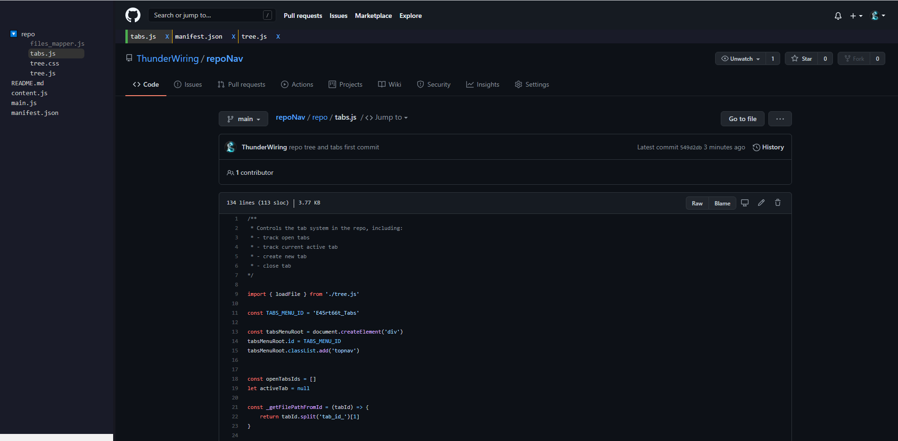

# RepoNav

A chrom extension that makes it easy to navigate a repository

## Supporting
* File system tree view that marks the current active file
* Tabs to allow convienient switching between opened files
* Switching between branches

## Manual Install
Currently this extention is not in the Chrom Web Store, but you can install it 
manually like so:
* download the code (unzipp it)
* visit chrome://extensions/
  *  Make sure to toggle 'Developer mode' in the top right corner
  *  Click 'Load unpacked' and chose the code downloaded earlier
* Open a Github repo, reload it.
* Enjoy :)

## Demo
Looks amazing with Github's dark mode!
